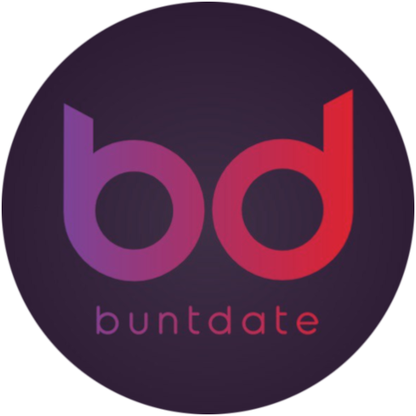

<!-- PROJECT LOGO -->
 

  
  <h3 align="center">BuntDate</h3>
  

    Dating and Community Management
     
    <a href="https://buntdate.de/"><strong>Visit Website »</strong></a>
     
     
    <a href="https://discord.gg/66jEfKasd2">Discord Community</a>
    ·
    <a href="https://t.me/buntdate_community">Telegram Community</a>
  

<!-- TABLE OF CONTENTS -->

  
Table of Contents

  
TODO

---

<!-- ABOUT THE PROJECT -->

## About The Project

[![ScreenBanner][product-banner]](https://buntdate.de)

### BuntDate - Dating and Community

### A Platform mixed in Telegram, Discord and the Web to connect peaople and their interests

TODO add detailed description

(<a href="#readme-top">back to top</a>)

---

<!-- CONTACT -->

## Contact

-   Telegram - [@buntdate_community](https://t.me/buntdate_community)
-   Discord - [BuntDate Community](https://discord.gg/66jEfKasd2)
-   Email - contact@buntdate.de

(<a href="#readme-top">back to top</a>)

---

[product-banner]: assets/banner-2.jpg
